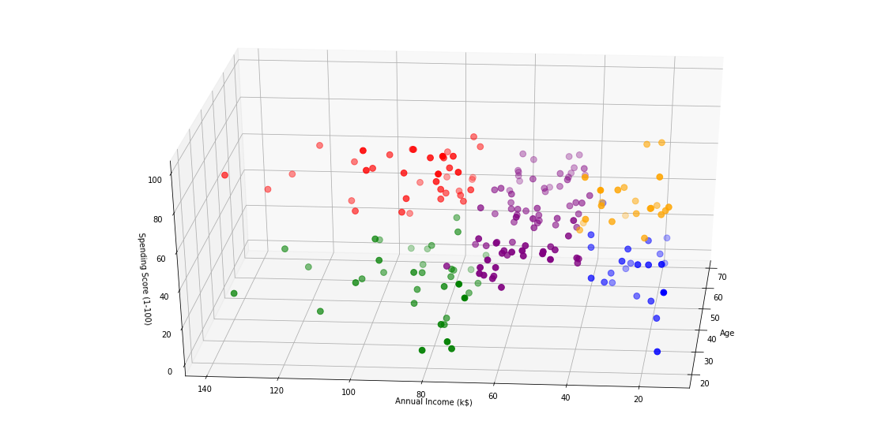

# Customers-Segmentation

  

## 📌**Objective**
This case requires to develop a customer segmentation to understand customers behavior and sepparate them in different groups or cluster according to their preferences, and once the division is done, this information can be given to marketing team so they can plan the strategy accordingly.

## 📁 **Data Description**
The sample Dataset summarizes the usage behavior of about 200 active customers during the last 3 months. The file is at a customer level with 5 behavioral variables.

## 🔑**Prerequisites**
All the required libraries are included in the file <code>requirements.txt</code>

## ⚠️**TechStack/framework used**
- Machine Learning
- Clustering
- K-Means
- Agglomerative
- GaussianMixture Model
- DBSCAN
- Dunn Index
- Silhouette Score

## 👬**Clustering**

  

## ❤️**Owner**
Made With ❤️ by [Sidharth kumar mohanty](www.linkedin.com/in/sidharth178)

## 😖Troubleshoot
Any issues??? Feel free to ask.[Linkedin](www.linkedin.com/in/sidharth178)

If you find this repo useful,don't forget to give a ⭐
